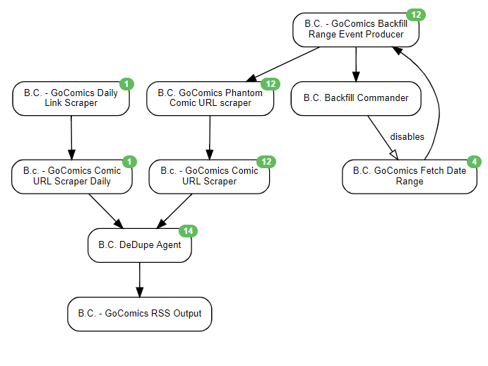

This scenario was designed to scrape the B.C. comic strip GoComics page and output to RSS

## Author Notes
I've also included a method of backfilling all the way back to the first release.
The Backfill is set to do 2 backfills at a time. Otherwise it looks like GoComics IP blocks.

## Schedule
* 30 Minutes

## Agents Used
* Rss Agent
* Website Agent
* Data Output Agent
* Commander Agent
* Java Script Agent
* Phantom Js Cloud Agent
* De Duplication Agent

## End Outputs:
* RSS

## diagram

