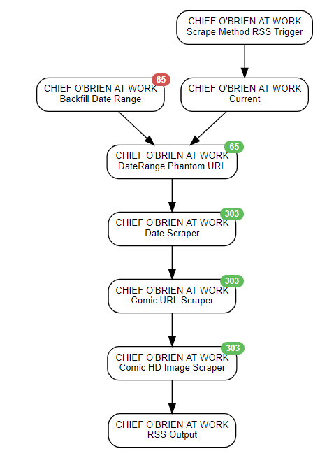

This scenario was designed to scrape the CHIEF O'BRIEN AT WORK comic strip page and output to RSS

## Author Notes
This scenario was one I'd wanted for a long time. Tumblr doesn't make it easy to get the HD image.
I've also included a method of backfilling all the way back to 2014.

## Schedule
* 30 Minutes

## Agents Used
* Rss Agent
* Java Script Agent
* Phantom Js Cloud Agent
* Website Agent
* Data Output Agent

## End Outputs:
* RSS

## Credentials used:
* `phantomjscloud_api_key`

## diagram

