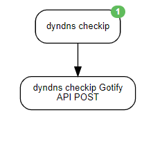

This scenario was designed to let me know via push notification if my external IP address has changed.

## Author Notes
The `priority` value MUST be an integer. To change this from a string, I had to toggle-view and remove the quotations.
If you remove priority value, Gotify will assume a value of `0`.
Android notification settings can be tweaked to handle phone volume per priority level.

If you don't want a clickable URL in gotify, remove the `extra` section of the `payload`

## Schedule
* 5 Minutes

## Agents Used
* Website Agent
* Json Api Agent

## End Outputs:
* Gotify

## Credentials used:
* `gotify_url`
* `gotify_token`

## diagram

