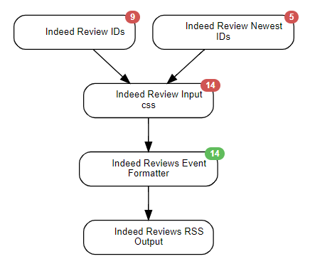

This scenario was designed to scrape the Indeed Reviews Page, and Output to an RSS feed.

## Schedule
* 1 Hour

## Agents Used
* Website Agent
* Data Output Agent
* Event Formatting Agent

## End Outputs:
* RSS

## Credentials used:
* `indeed_business_name`

## diagram

