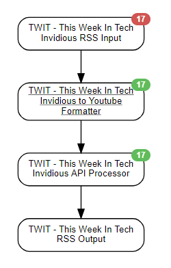

This scenario was designed to output youtube RSS feeds with some unique tweaks.

* I use a selfhosted invidious with ZERO caching on the RSS Feeds.
* I wanted the video duration in the title of my feed so I know how long it is before clicking
    This involved an API Call
* I wanted to see when it was posted in the title
* I wanted the final result output to easily work with my android phone (selfoss) and chromecast.
* To clone this repeatedly, I open the JSON file and blank the GUIDs of the agents, change the channel info.

## Schedule
* I schedule these based on how important they are to me

## Agents Used
* Website Agent
* Data Output Agent
* Event Formatting Agent
* Rss Agent

## End Outputs:
* RSS

## Credentials used:
* `YOURCHANNELID`

## diagram

