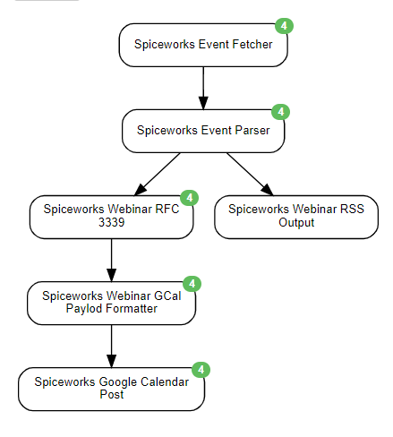

This scenario was designed to scrape the Comptia Upcoming Events Page, and Output to a google calendar as well as an RSS feed to notify me that I can register for a webinar.

## Schedule
* 1 Hour

## Agents Used
* Website Agent
* Google Calendar Publish Agent
* Event Formatting Agent
* Data Output Agent
* Java Script Agent

## End Outputs:
* Google Calendar
* RSS

## Credentials used:
* `google_api_service_email`
* `google_calendar_id_comptia`
* `google_api_key_file`

## diagram

