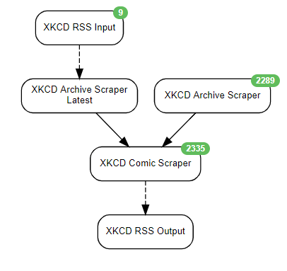

This scenario was designed to scrape the XKCD comic strip page and output to RSS

## Author Notes
I've also included a method of backfilling all the way back to the first release.
I do want to point out that I had to increase `DELAYED_JOB_MAX_RUNTIME` to 5 minutes to create the jobs from the archive page.

## Schedule
* 30 Minutes

## Agents Used
* Rss Agent
* Website Agent
* Data Output Agent

## End Outputs:
* RSS

## diagram

